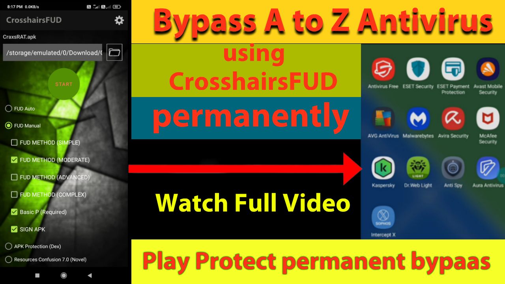
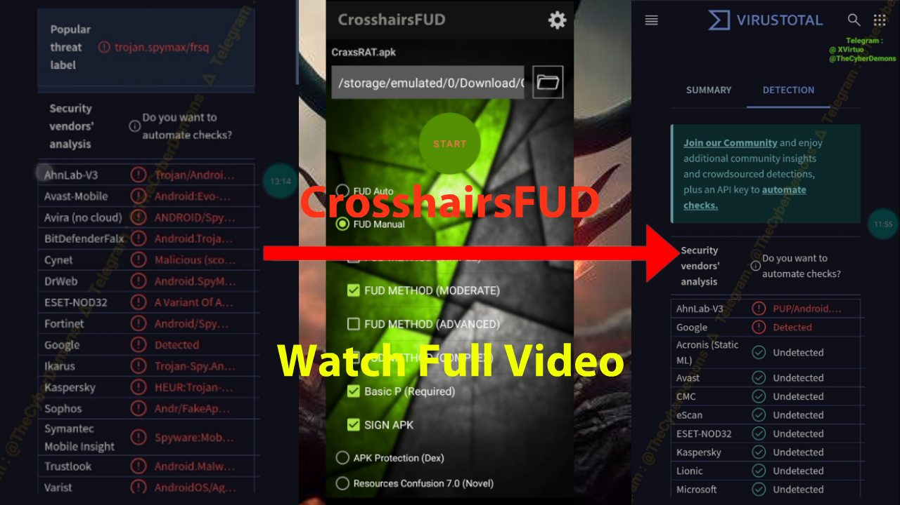

# CrosshairsFUD - Android Antivirus Bypass Tool

**CrosshairsFUD** is an advanced Android antivirus bypass tool that can bypass all Android antivirus software and security measures, including Google Play Protect. The tool can crypt any Android malware such as RATs, Trojans, and backdoors, making them Fully UnDetectable (FUD). It has been tested on multiple payloads, including CraxsRat, with consistent FUD results.

## Features
- **Full Android Antivirus Bypass**: Tested and proven to bypass all Android antivirus software and Google Play Protect.
- **Support for Multiple Payloads**: Encrypt and obfuscate any Android RAT, Trojan, or backdoor.
- **VirusTotal Undetectable**: Proven results on VirusTotal with 0 detections.
- **Uncut Demonstration**: Video proof of CrosshairsFUD's capabilities, including real-time tests.

## Demonstration Videos

1. **Bypassing Top 10 Android Antivirus & Google Play Protect**  

2. **VirusTotal Results**  

Both videos demonstrate CrosshairsFUD's functionality, using the CraxsRat payload in uncut tests.

## Contact

- **Telegram**: [@TheCyberDemons](https://t.me/TheCyberDemons)

## Disclaimer
This tool is intended **solely for educational purposes** and **security testing**. The developers and distributors of **CrosshairsFUD** do not support or endorse illegal activities. **We are not responsible for any misuse** of this tool, and it is strictly advised that the tool be used in compliance with local, national, and international laws.
